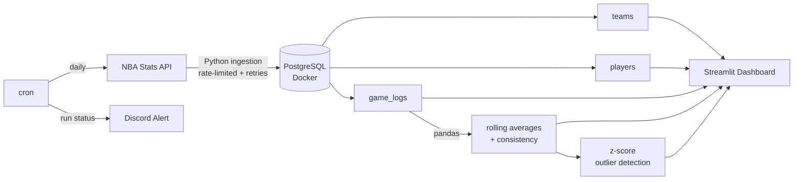
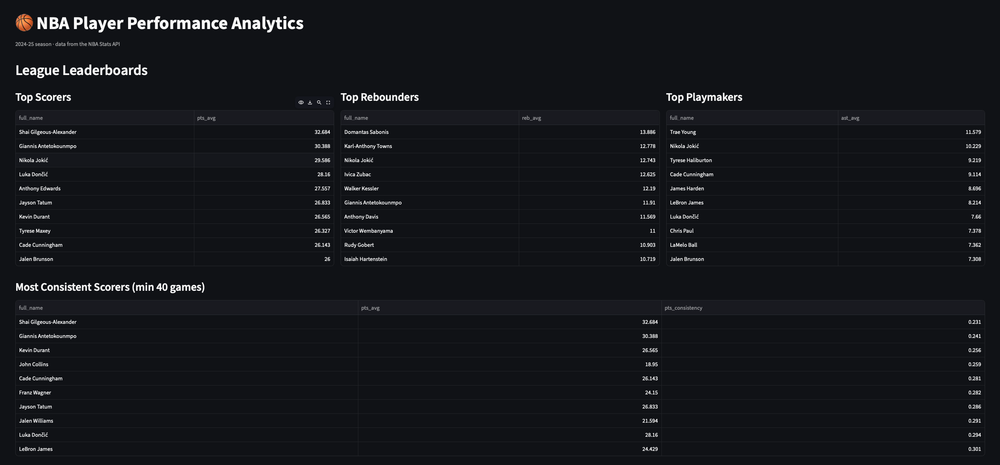
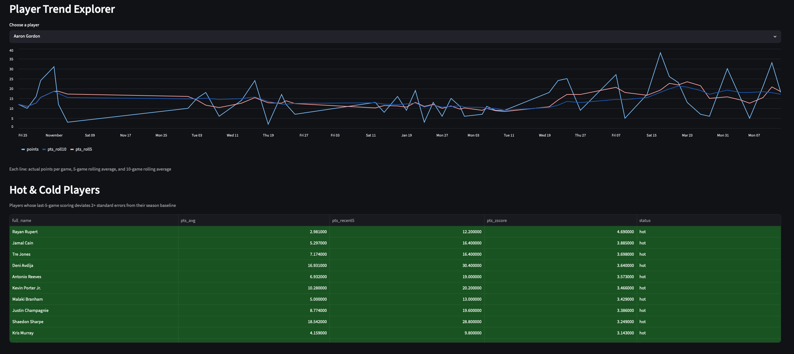
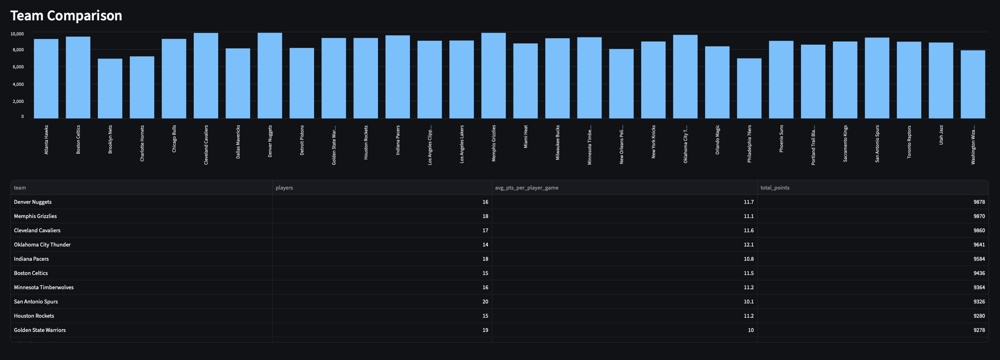

# NBA Player Performance Analytics Pipeline

Daily analytics pipeline pulling 2024-25 NBA player stats from the NBA Stats API, computing performance trends and statistical outliers, and surfacing them in an interactive dashboard.

## Pipeline



## Architecture
- **Database:** PostgreSQL running in Docker, defined as code in `docker-compose.yml`
- **Ingestion:** Python pulls game logs from the NBA Stats API with request throttling, retry logic, and idempotent upserts (`INSERT ... ON CONFLICT`)
- **Transformations:** pandas computes rolling averages (5 & 10 game), season summaries, and consistency metrics (coefficient of variation)
- **Analytics:** z-score outlier detection identifies players over/underperforming their season baseline, normalized by individual variance
- **Dashboard:** Standalone Streamlit app — leaderboards, player trend explorer, hot/cold tracker, team comparison
- **Orchestration:** cron-scheduled daily runs with Discord webhook notifications

## Stack
PostgreSQL · Docker · Python · pandas · Streamlit · cron · Discord

## Schema
- `teams`, `players` — reference dimensions
- `game_logs` — one row per player per game (composite PK, FK-enforced)
- `player_rolling_stats`, `player_season_summary`, `player_outliers` — derived analytics

## Dashboard




## Running Locally
```bash
docker compose up -d              # start Postgres
python ingestion/init_db.py       # create schema
python ingestion/load_reference.py
python ingestion/load_game_logs.py
python transforms/compute_metrics.py
python transforms/detect_outliers.py
streamlit run dashboard/app.py    # launch dashboard
```